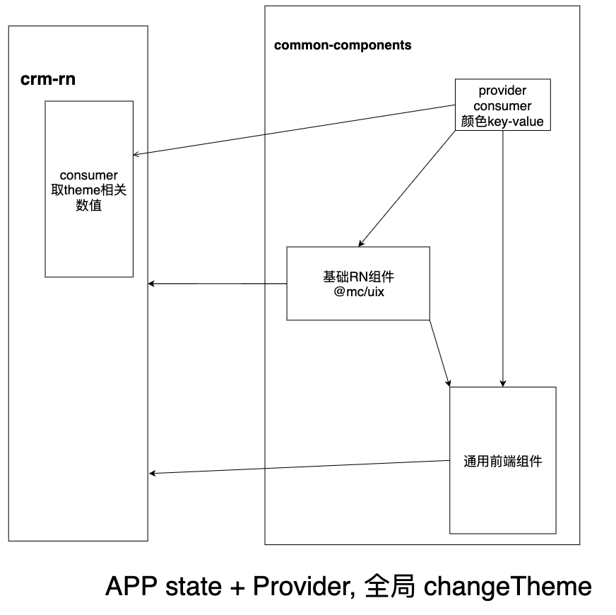

## 通用前端

## 架构分析图



## 逻辑实现

### 整体实现

- 预定义主题变量 key-value 键值对
- React Context 提供全局传值，切换 theme、实时刷新 UI 能力
- APP state 改变主题

### 主题色的使用

- 组件维度定义时直接使用主题变量
- 业务代码 通过 consumer 取到 theme 值
- 外部组件，如供应链、基础 RN 组件、在通用前端（中间层）设置主题变量和解析，达到使用时可直接通过主题变量设置对应颜色

### 其他细节

- CStyleSheet 提供创建 styles 时的代码提示
- 二次封装组件取消 consumer 函数式写法
- 二次封装通过 TS 提供使用通用前端组件时的主题变量提示

### 改写 RN 组件

#### props-style 类型重写，提供提示

剔除 style 中原有颜色，增加新颜色

```ts
type PickKeys =
  | "backgroundColor"
  | "color"
  | "borderColor"
  | "borderLeftColor"
  | "borderRightColor"
  | "borderBottomColor"
  | "borderTopColor";

type NodeStyle<S> = Omit<S, PickKeys> & ContainColorStyle<S>;
```

#### 解析重写的 style，转换 RNStyle 赋值

```tsx
function resolveProps<P extends NodeProps<CustomColorStyle>>(
  props: P
): Omit<P, "style"> & { style?: RNColorStyle } {
  // 函数式组件调用时取到对应值
  const { theme } = useTheme();
  const { style, ...restProps } = props;
  const flatStyle = StyleSheet.flatten(style) || {};
  PickKeysArray.forEach((item) => {
    const v = flatStyle[item];
    if (v && theme[v]) {
      flatStyle[item] = theme[v];
    }
  });
  return {
    style: flatStyle,
    ...restProps,
  };
}
```
