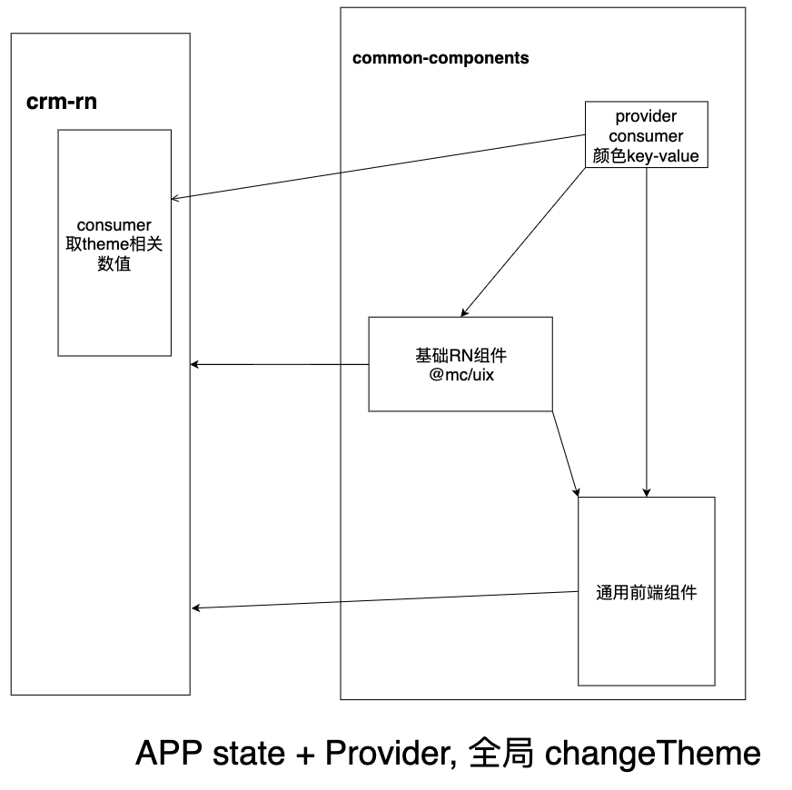

## 通用前端
## 架构分析图

## 逻辑实现
- 定义主题key-value键值对
- React Context 提供全局传值能力
- APP state 绑定changeTheme方法-->改变theme取值-->更新主题样式
### 改写RN组件
#### props-style 类型重写，提供提示
剔除style中原有颜色，增加新颜色
```ts
type PickKeys = "backgroundColor" | "color" | "borderColor" | "borderLeftColor" | "borderRightColor" | "borderBottomColor" | "borderTopColor";

type NodeStyle<S> = Omit<S, PickKeys> & ContainColorStyle<S>;
```
#### 解析重写的style，转换RNStyle赋值
```tsx
function resolveProps<P extends NodeProps<CustomColorStyle>>(props: P): Omit<P, 'style'> & {style?: RNColorStyle}{
    // 函数式组件调用时取到对应值
  const {theme} = useTheme();
  const {style, ...restProps} = props;
  const flatStyle = StyleSheet.flatten(style) || {};
  PickKeysArray.forEach((item) => {
    const v = flatStyle[item];
    if(v && theme[v]) {
      flatStyle[item] = theme[v];
    }
  });
  return {
    style:flatStyle, 
    ...restProps
  }
}
```